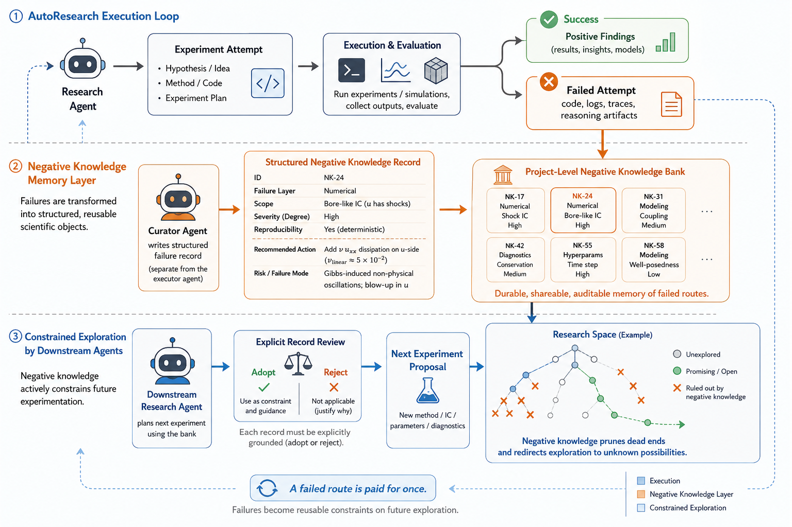

# Negative Knowledge

[](https://arxiv.org/abs/2606.21024)
[](LICENSE)
[](https://www.python.org/downloads/)

A failure-aware shared memory layer for AutoResearch. Instead of
discarding failed attempts as transient debugging noise, a **curator**
turns each failure into a bounded, typed *negative-knowledge (NK)
record*, and downstream **research agents** read the bank — adopting or
rejecting records — before proposing their next experiment. Failures
become reusable constraints that steer exploration away from dead ends.

This is the reference implementation for the ICML 2026 AI4Research
Workshop paper [*Negative Knowledge as Failure-aware Shared Memory for
AutoResearch*](https://arxiv.org/abs/2606.21024).



*A separate curator converts the artifacts of each failed attempt (code,
logs, traces, reasoning) into a bounded, typed record in a shared
project-level bank. Before proposing a new experiment, downstream agents
inspect the bank and explicitly adopt or reject the relevant records, so
documented dead ends become reusable constraints that redirect
exploration toward routes not yet ruled out.*

## Install

The core is a single, dependency-free module. Copy
[`negative_knowledge.py`](negative_knowledge.py) straight into your
project, or install from a checkout / Git:

```bash
pip install .                                       # from a checkout
pip install git+https://github.com/hch-wang/Negative_Knowledge.git
```

It is **provider-neutral**: you supply any JSON-capable model backend, so
nothing in the core depends on a particular LLM SDK.

## Quickstart

```python
from negative_knowledge import curate, validate, append, load

def backend(prompt: str) -> str:
    # Call any model you like; it must return one JSON object as text.
    return your_agent.complete(prompt)

record = curate(
    backend,
    task_id="072",
    task="Map Sub01 EEG signals to Sub03 ...",
    evidence={
        "code": failed_code,
        "error": stderr,
        "reasoning": reasoning,
    },
)

append("negative_knowledge.jsonl", record)          # persist as JSONL
memory = load("negative_knowledge.jsonl")            # read the bank back
```

Two runnable end-to-end demos (offline — no API key, no SDK):

```bash
python examples/quickstart.py   # producer side: curate -> append -> load
python examples/agent_loop.py   # consumer side: adopt / reject, then propose
```

## The NK record schema

Each record is a JSON object whose typed core fields draw from closed
vocabularies, so no field is free text in a way that defeats machine
consumption:

```
task_id, attempted_route, observation,
failure { layer, scope, degree, recommended_action, risk },
rationale, recommended_alternative
```

`validate(record)` enforces this contract — the six core fields plus the
closed `failure.*` vocabulary — and returns a list of problems (empty
means valid). Records may also carry **extra fields** (for example a
round index or cross-round notes); these are accepted as extensions.

| `failure.` field | allowed values |
|---|---|
| `layer` | `implementation_failure` · `communication_failure` · `method_failure` · `hypothesis_failure` · `measurement_failure` |
| `scope` | `local_failure` · `regime_bound_failure` · `general_failure` |
| `degree` | `contradicted` · `partial` · `inconclusive` · `unstable` · `artifact_driven` · `overclaimed` |
| `recommended_action` | `retry` · `change_method` · `narrow_claim` · `abandon_route` |
| `risk` | `low_risk_omission` · `medium_risk_drift` · `high_risk_false_progress` |

Length limits: `task_id` ≤ 128, `attempted_route` / `observation` ≤ 600,
`rationale` / `recommended_alternative` ≤ 1200 characters. The same
vocabularies are importable as `LAYERS`, `SCOPES`, `DEGREES`, `ACTIONS`,
`RISKS` from [`negative_knowledge.py`](negative_knowledge.py).

```python
from negative_knowledge import validate
issues = validate(record)                            # [] == valid
```

## API

| Function | Purpose |
|---|---|
| `curate(backend, *, task_id, task, evidence)` | ask any JSON-capable backend to turn failure evidence into one validated record |
| `validate(record)` | list of schema problems (empty = valid) |
| `append(path, record)` | validate and append one record to a JSONL bank |
| `load(path)` | load and validate every record from a JSONL bank |

## Repository layout

```
negative_knowledge.py   the single-file, dependency-free module
examples/               quickstart.py (producer) + agent_loop.py (consumer)
docs/                   ARCHITECTURE.md + the overview figure
reproduction/           everything behind the paper's numbers (see below)
tests/                  unit tests: python -m unittest discover -s tests
```

## Reproducing the paper

All experiments, logs, banks, and verification scripts live under
[`reproduction/`](reproduction/) — one subdirectory per study
(`section3/`, `section4/`, `appendix/`). Every number in the paper can be
re-derived from bundled artifacts with no API key:

```bash
cd reproduction/section3 && python analyze_results.py   # 31/31 claims match
python count_tokens.py                                   # Table 1 token figures
```

Optional fresh-agent re-runs are provider-neutral via the
`NK_AGENT_COMMAND` protocol (see
[`reproduction/agent_command.py`](reproduction/agent_command.py) and
[`reproduction/README.md`](reproduction/README.md)).

## Citation

If you find this work useful, please cite the paper:

```bibtex
@inproceedings{wang2026negative,
  title     = {Negative Knowledge as Failure-aware Shared Memory for {AutoResearch}},
  author    = {Wang, Hanchun},
  booktitle = {ICML 2026 AI4Research Workshop on AI as a Tool for Mathematics, Computer Science, and Machine Learning},
  year      = {2026},
  url       = {https://github.com/hch-wang/Negative_Knowledge}
}
```
